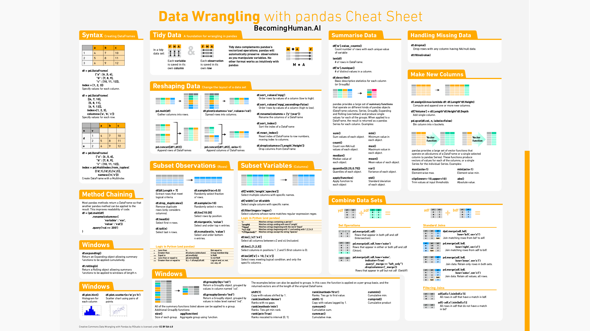

# cracking-the-data-science-interview-in-7-days

Here are the sections:

* [Data Science Cheatsheets](#data-science-cheatsheets)
* [Data Science Case Studies](#data-science-case-studies)
* [Data Science Portfolio](#data-science-portfolio)
* [Data Journalism Portfolio](#data-journalism-portfolio)
* [Downloadable Cheatsheets](#downloadable-cheatsheets)

## Data Science Cheatsheets

[This section](https://github.com/piyushpathak03/cracking-the-data-science-interview-in-7-days/tree/master/Cheatsheets) contains cheatsheets of basic concepts in data science that will be asked in interviews:

* [SQL](https://github.com/piyushpathak03/cracking-the-data-science-interview-in-7-days/tree/master/Cheatsheets#sql)
* [Statistics and Probability](https://github.com/piyushpathak03/cracking-the-data-science-interview-in-7-days/tree/master/Cheatsheets#statistics-and-probability)
* [Mathematics](https://github.com/piyushpathak03/cracking-the-data-science-interview-in-7-days/tree/master/Cheatsheets#mathematics)
* [Machine Learning Concepts](https://github.com/piyushpathak03/cracking-the-data-science-interview-in-7-days/tree/master/Cheatsheets#machine-learning-concepts)
* [Deep Learning Concepts](https://github.com/piyushpathak03/cracking-the-data-science-interview-in-7-days/tree/master/Cheatsheets#deep-learning-concepts)
* [Supervised Learning](https://github.com/piyushpathak03/cracking-the-data-science-interview-in-7-days/tree/master/Cheatsheets#supervised-learning)
* [Unsupervised Learning](https://github.com/piyushpathak03/cracking-the-data-science-interview-in-7-days/tree/master/Cheatsheets#unsupervised-learning)
* [Computer Vision](https://github.com/piyushpathak03/cracking-the-data-science-interview-in-7-days/tree/master/Cheatsheets#computer-vision)
* [Natural Language Processing](https://piyushpathak03/cracking-the-data-science-interview-in-7-days/tree/master/Cheatsheets#natural-language-processing)
* [Stanford Materials](https://github.com/piyushpathak03/cracking-the-data-science-interview-in-7-days/tree/master/Cheatsheets#stanford-materials)

## Data Science Case Studies
[This section](https://github.com/piyushpathak03/cracking-the-data-science-interview-in-7-days/tree/master/Case-Studies) contains case study questions that concern designing machine learning systems to solve practical problems.

## Data Science Portfolio

This section contains portfolio of data science projects completed by me for academic, self learning, and hobby purposes.

For a more visually pleasant experience for browsing the portfolio, check out [jameskle.com/data-portfolio](https://jameskle.com/data-portfolio)

- ### Computer Vision

    - [Dog Breed Classification](https://medium.com/nanonets/how-to-easily-build-a-dog-breed-image-classification-model-2fd214419cde): Designed a Convolutional Neural Network that identifies dog breed.

    - [Road Segmentation](https://medium.com/nanonets/how-to-do-image-segmentation-using-deep-learning-c673cc5862ef): Implemented a Fully-Convolutional Network for semantic segmentation task in the Kitty Road Dataset.

    _Tools: TensorFlow, Keras, Pandas, NumPy, Matplotlib, Scikit-Learn, TensorBoard_

- ### Natural Language Processing

    - [Classifying Tweets with Weights & Biases](https://www.wandb.com/articles/classifying-tweets-with-wandb): Developed 3 different neural network models that classify tweets on a crowdsourced dataset in Figure Eight.

## Data Journalism Portfolio

This section contains portfolio of data journalism articles completed by me for freelance clients and self-learning purposes.

For a more visually pleasant experience for browsing the portfolio, check out [jameskle.com/data-journalism](https://jameskle.com/data-journalism)

- ### Statistics

    - [The 10 Statistical Techniques Data Scientists Need to Master](https://www.kdnuggets.com/2017/11/10-statistical-techniques-data-scientists-need-master.html)

    - [Logistic Regression Tutorial](https://www.datacamp.com/community/tutorials/logistic-regression-R)

    - [Decision Trees Tutorial](https://www.datacamp.com/community/tutorials/decision-trees-R)

    - [Support Vector Machines Tutorial](https://www.datacamp.com/community/tutorials/support-vector-machines-r)

    - [A Friendly Introduction to Data-Driven Marketing for Business Leaders](https://www.topbots.com/data-driven-marketing-for-business-leaders/)

- ### Machine Learning

    - [The 10 Algorithms Machine Learning Engineers Need to Know](https://www.kdnuggets.com/2016/08/10-algorithms-machine-learning-engineers.html)

    - [12 Useful Things to Know About Machine Learning](https://www.kdnuggets.com/2018/04/12-useful-things-know-about-machine-learning.html)

    - [A Tour of The Top 10 Algorithms for Machine Learning Newbie](https://builtin.com/data-science/tour-top-10-algorithms-machine-learning-newbies)

    - [The 10 Data Mining Techniques Data Scientists Need For Their Toolbox](https://builtin.com/data-science/10-data-mining-techniques-data-scientists-need-their-toolbox)

    - [Clustering and Classification in E-Commerce](https://lucidworks.com/2019/01/24/clustering-classification-supervised-unsupervised-learning-ecommerce/)

    - [The ABCs of Learning to Rank](https://lucidworks.com/post/abcs-learning-to-rank/)

    - [6 Ways to Debug a Machine Learning Model](https://www.wandb.com/articles/debug-ml-model)

- ### Deep Learning

    - [The 10 Deep Learning Methods AI Practitioners Need to Apply](https://www.kdnuggets.com/2017/12/10-deep-learning-methods-ai-practitioners-need-apply.html)

    - [The 8 Neural Network Architectures ML Researchers Need to Learn](https://www.kdnuggets.com/2018/02/8-neural-network-architectures-machine-learning-researchers-need-learn.html)

    - [The 5 Deep Learning Frameworks Every Serious Machine Learner Should Be Familiar With](https://heartbeat.fritz.ai/the-5-deep-learning-frameworks-every-serious-machine-learner-should-be-familiar-with-93f4d469d24c)

    - [The 5 Computer Vision Techniques That Will Change How You See The World](https://heartbeat.fritz.ai/the-5-computer-vision-techniques-that-will-change-how-you-see-the-world-1ee19334354b)

    - [Convolutional Neural Networks: The Biologically-Inspired Model](https://www.codementor.io/@james_aka_yale/convolutional-neural-networks-the-biologically-inspired-model-iq6s48zms)

    - [Recurrent Neural Networks: The Powerhouse of Language Modeling](https://builtin.com/data-science/recurrent-neural-networks-powerhouse-language-modeling)

    - [The 7 NLP Techniques That Will Change How You Communicate in the Future](https://heartbeat.fritz.ai/the-7-nlp-techniques-that-will-change-how-you-communicate-in-the-future-part-i-f0114b2f0497)

    - [The 5 Trends Dominating Computer Vision in 2018](https://heartbeat.fritz.ai/the-5-trends-that-dominated-computer-vision-in-2018-de38fbb9bd86)

    - [The 3 Deep Learning Frameworks For End-to-End Speech Recognition That Power Your Devices](https://heartbeat.fritz.ai/the-3-deep-learning-frameworks-for-end-to-end-speech-recognition-that-power-your-devices-37b891ddc380)

    - [The 5 Algorithms for Efficient Deep Learning Inference on Small Devices](https://heartbeat.fritz.ai/the-5-algorithms-for-efficient-deep-learning-inference-on-small-devices-bcc2d18aa806)

    - [The 4 Research Techniques to Train Deep Neural Network Models More Efficiently](https://heartbeat.fritz.ai/the-4-research-techniques-to-train-deep-neural-network-models-more-efficiently-810ea2886205)

    - [The 2 Hardware Architectures for Efficient Training and Inference of Deep Nets](https://heartbeat.fritz.ai/the-2-types-of-hardware-architectures-for-efficient-training-and-inference-of-deep-neural-networks-a034850e26dd)

    - [10 Deep Learning Best Practices to Keep in Mind in 2020](https://nanonets.com/blog/10-best-practices-deep-learning/)

## Downloadable Cheatsheets

These PDF cheatsheets come from [BecomingHuman.AI](https://becominghuman.ai/cheat-sheets-for-ai-neural-networks-machine-learning-deep-learning-big-data-science-pdf-f22dc900d2d7).

### 1 - Neural Network Basics

### 2 - Neural Network Graphs

### 3 - Machine Learning with Emojis

### 4 - Scikit-Learn With Python

### 5 - Python Basics

### 6 - NumPy Basics

### 7 - Pandas Basics

### 8 - Data Wrangling With Pandas

### 9 - SciPy Linear Algebra

### 10 - Matplotlib Basics

### 11 - Keras

### 12 - Big-O

follow me at 

